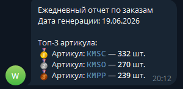

# Wildberries Orders Analytics

## Описание

Приложение автоматически выполняет ежедневную обработку заказов Wildberries:

* получает заказы за предыдущий день через API Wildberries;
* сохраняет данные в CSV-файл;
* формирует отчет по заказам;
* отправляет уведомление в Telegram с топ-3 артикулами по количеству заказов.

---

## Структура проекта

```text
project/
│
├── app/
│   ├── config.py
│   │
│   ├── clients/
│   │   ├── wb_client.py
│   │   └── telegram_client.py
│   │
│   ├── services/
│   │   └── report_service.py
│   │
│   ├── storage/
│   │   └── csv_storage.py
│   │
│   └── main.py
│
├── data/
│   └── orders.csv
│
├── .env
├── requirements.txt
└── README.md
```

---

## Установка

Клонировать репозиторий:

```bash
git clone https://github.com/afkXesP/wb_orders_monitor.git
cd wb_orders_monitor
```

Создать виртуальное окружение:

```bash
python -m venv venv
```

Активировать виртуальное окружение:

Linux/macOS:

```bash
source venv/bin/activate
```

Windows:

```bash
venv\Scripts\activate
```

Установить зависимости:

```bash
pip install -r requirements.txt
```

---

## Настройка

1. Создайте файл окружения:
```bash
cp .env_example .env
```

2. Создайте бота через BotFather и получите `TELEGRAM_BOT_TOKEN`
3. Отправьте боту любое сообщение.
4. Выполните запрос:

```text
https://api.telegram.org/bot<YOUR_BOT_TOKEN>/getUpdates
```

5. В ответе найдите поле:

```json
"chat": {
    "id": 123456789
}
```

6. Использовать это значение как `TELEGRAM_CHAT_ID`.

---

## Запуск

Из корневой директории проекта:

```bash
python -m app.main
```

После запуска:

* будет создан файл `data/orders.csv`;
* будет отправлено сообщение в Telegram с отчетом по заказам.

---

## Формат CSV

Сохраняются следующие поля:

| Поле         | Описание         |
| ------------ | ---------------- |
| order_date   | дата заказа      |
| article      | артикул продавца |
| product_name | название товара  |
| status       | статус заказа    |
| price        | стоимость заказа |

---

## Формат Telegram-сообщения

Пример сообщения:



Топ-3 рассчитывается по количеству заказов для каждого артикула среди неотмененных заказов.

---

## Выбор хранилища данных

Для хранения истории заказов вместо Google Sheets я бы использовал PostgreSQL.

Причины выбора:

* без проблем работает с объемами данных значительно больше 100 000 записей;
* поддерживает индексацию и быстрые аналитические запросы;
* хорошо интегрируется с Python;
* подходит для последующего использования данных в аналитических системах и ИИ-инструментах.

Рассмотренные альтернативы:
* Google Sheets: не подходит из-за ограничений по количеству ячеек и ухудшения производительности при росте объема данных.
* CSV: удобен для выгрузки данных, но неудобен для поиска, фильтрации и аналитики.


Для анализа данных с использованием LLM и аналитических инструментов данные из PostgreSQL можно быстро получать через SQL-запросы или загружать в Pandas DataFrame без промежуточных преобразований. Это уменьшает объем передаваемых данных и позволяет формировать выборки непосредственно на стороне базы данных.

---

## Возможные улучшения

Если бы решение разрабатывалось для production-среды, я бы дополнительно реализовал:

* хранение данных в PostgreSQL вместо CSV;
* запуск по расписанию через cron или Celery Beat;
* структурированное логирование;
* автоматические повторы запросов при временных ошибках API;
* Docker и docker-compose для развертывания;
* unit-тесты для бизнес-логики;
* мониторинг и уведомления о сбоях;
* дедупликацию заказов при повторных запусках.


